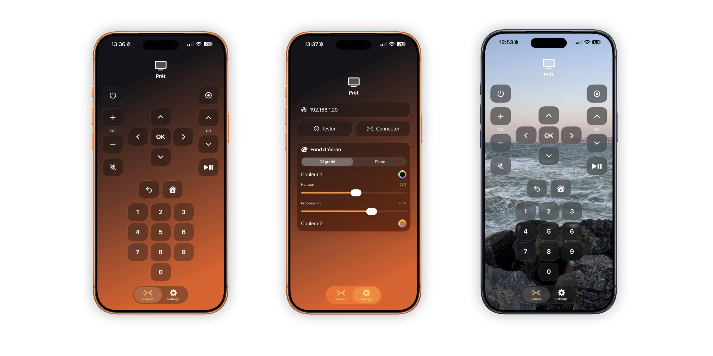

# Remoteglass
Simple remote app for Orange France TV decoders, built (vibecoded) in Swift.

## Features
- Local
- No login
- Liquid Glass
- Works will all Orange decoders (Currently tested with Livebox 5's UHD Decoder)
- Customizable background with gradient or photo
- Haptic feedbacks
- ADS FREE

## Usage
- Click "Connect"
- Choose your Decoder ip
- That's all

## Known issues
Buttons and some other UI elements turn white after leaving the app
